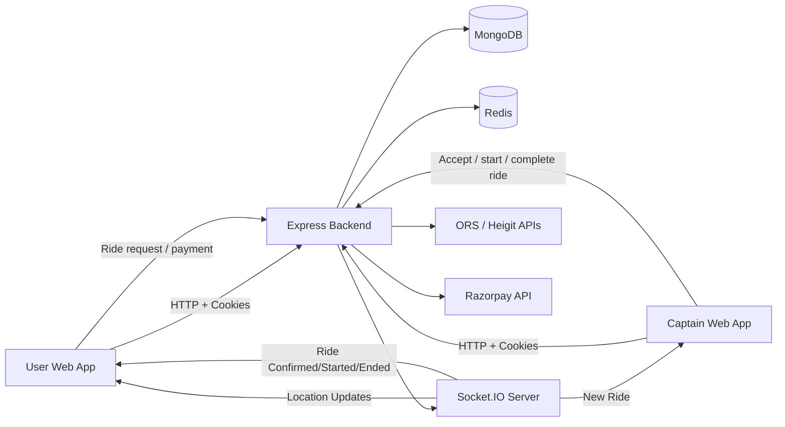
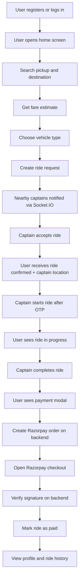
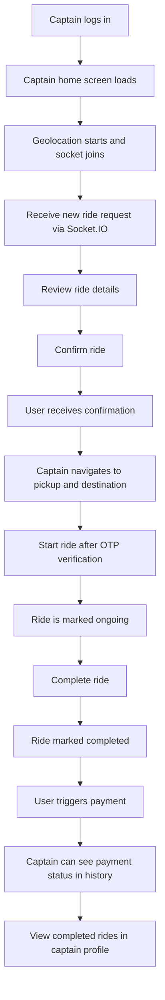
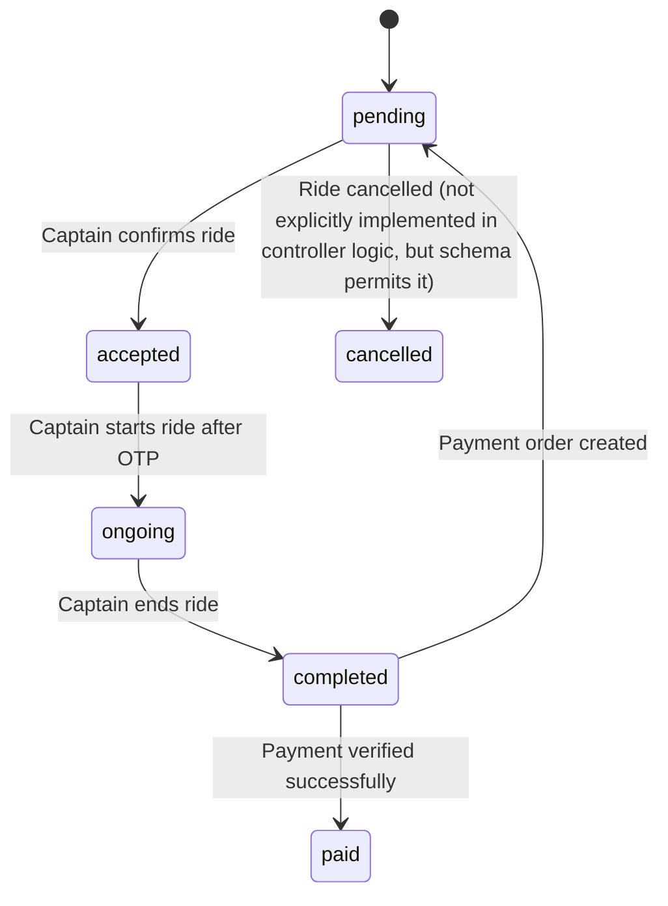
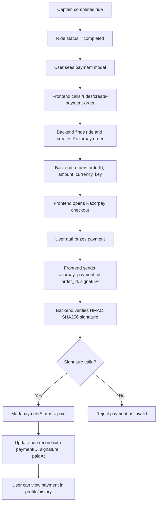
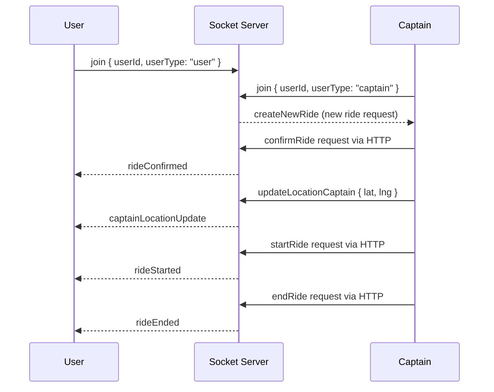
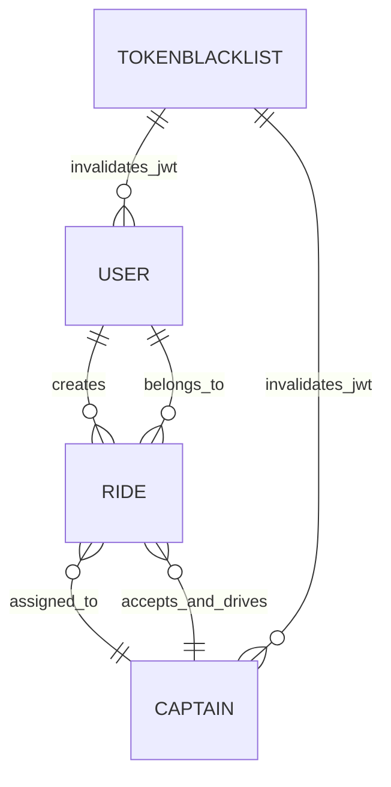
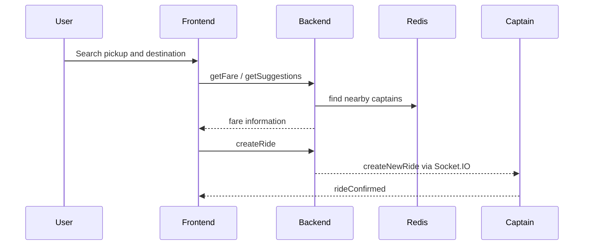

# GoSafar

GoSafar is a ride-hailing web application built as a full-stack Node.js + React project. The application supports two roles:

- User: register/login, search for a trip, see fare estimates, request a ride, track the captain, complete the ride, pay, and view ride history.
- Captain: register/login, go online, receive ride requests, accept rides, start journeys after OTP validation, complete rides, and view captain ride history.

The project uses a MongoDB-backed backend, Redis for fast geo/location and profile caching, Socket.IO for real-time ride and location updates, and Razorpay test payments for the final payment step.

---

## 1. Project Overview

GoSafar follows a typical real-time ride-hailing flow, but in a compact project structure tailored to the application’s actual code.

### What the app does

- Users can create an account and log in.
- Users can search for pickup and destination locations using an autocomplete-style address lookup.
- The app estimates a fare based on distance and duration returned from an external routing API.
- Users can choose a vehicle type (`auto`, `car`, `moto`) and request a ride.
- Nearby captains are identified using live location data in Redis and the captain’s stored location.
- Captains receive ride requests in real time over Socket.IO.
- Captains can accept a ride and complete the ride lifecycle.
- Users receive live location updates while the captain is en route.
- Captains validate ride start using a generated 6-digit OTP.
- Once a ride is completed, the user pays through Razorpay.
- The payment signature is verified on the backend before marking the ride as paid.
- User and captain profile screens show ride history.

### Main system responsibilities

- Frontend: Use React + Vite to render the user and captain interfaces.
- Backend: Serve APIs, auth, ride logic, validation, and payment verification.
- Database: Store user, captain, ride, and token blacklist records in MongoDB using Mongoose.
- Cache: Use Redis for profile caching and live captain geo-indexing.
- Real-time communication: Use Socket.IO for ride request broadcasts, live location updates, and ride state events.
- External services: Use OpenRouteService/Heigit geocoding/directions APIs and Razorpay.

---

## 2. Technology Stack

### Frontend technologies

The frontend is in the `frontend` folder and uses:

- React 19
- Vite
- React Router DOM
- Socket.IO client
- Axios for HTTP requests
- Tailwind CSS (via the app’s styling flow)
- Sass / SCSS for component and theme styling
- RemixIcon for icons
- Leaflet / React Leaflet for map rendering and route visuals
- GSAP + `@gsap/react` for UI transitions/animations

Why it is used in this project:

- React handles the user and captain interfaces.
- Vite enables quick frontend development and production builds.
- React Router enables the route system for login, home, ride, and profile screens.
- Socket.IO client connects the app to the server for real-time ride lifecycle events.
- Axios centralizes API calls to the backend.
- Tailwind and SCSS provide the mobile-app visual design.
- Leaflet is used for maps, and GSAP creates smooth transitions.

### Backend technologies

The backend is in the `backend` folder and uses:

- Node.js
- Express.js
- MongoDB + Mongoose
- Redis
- Socket.IO
- JWT (jsonwebtoken)
- bcrypt for password hashing
- express-validator for request validation
- cookie-parser for cookie-based auth
- cors for cross-origin resource sharing
- dotenv for environment loading
- Razorpay SDK for test payments
- Axios for outbound HTTP calls to external APIs

Why it is used in this project:

- Express handles route setup, controllers, middleware, auth, and API responses.
- Mongoose gives schema-based MongoDB models and validation.
- Redis is used for fast geo lookups and profile caching.
- Socket.IO powers real-time ride requests and location updates.
- JWT is used for session/auth tokens.
- bcrypt securely hashes user and captain passwords.
- express-validator validates request payloads.
- Razorpay handles payment order creation and verification.

### MongoDB

MongoDB is the primary database for all application entities, including:

- user profiles
- captain profiles
- rides
- token blacklist records

The database connection is created in `backend/src/config/db.js` and uses `mongoose.connect(...)`.

### Redis

Redis is implemented in the codebase and is used for:

1. Real-time captain geolocation: `backend/src/services/redis/redisCaptainGeo.service.js`
2. Profile caching: `backend/src/services/redis/redisProfileCache.service.js`

This means Redis is not a generic queue or event bus here; it is used as a fast lookup/index layer for live location and cached profile data.

### Socket.IO

Socket.IO is implemented in `backend/src/socket.js` and used for:

- joining users and captains to socket rooms
- sending new ride requests to captains
- sending captain location updates to users
- notifying users when a ride is confirmed, started, and ended

On the frontend, `frontend/src/contexts/SocketContext.jsx` creates the client-side socket connection.

### Kafka

Kafka is not implemented in this codebase.

There are no Kafka dependencies in `backend/package.json`, no producer/consumer code, and no Kafka-related config. This project uses Redis + Socket.IO for real-time event handling instead of Kafka.

### Razorpay Test API / payment system

The project uses Razorpay in test mode:

- Create an order on the backend with the Razorpay SDK.
- Send the order details to the frontend.
- Open Razorpay checkout in the browser.
- Collect the response from the payment modal.
- Verify the payment signature in the backend using HMAC SHA256.
- Mark the ride as paid only after verification succeeds.

This is implemented in:

- `backend/src/services/ride.service.js`
- `backend/src/controllers/ride.controller.js`
- `frontend/src/features/user/components/PaymentModal.jsx`
- `frontend/src/features/user/services/userHome.api.js`

### External APIs

The app makes outbound HTTP requests to the ORS/Heigit APIs:

- geocoding search: Pelias search API
- autocomplete suggestions: Pelias autocomplete API
- route distance/duration: OpenRouteService driving-car directions API

This is implemented in `backend/src/services/map.service.js`.

### Authentication / security libraries

Security features actually implemented in the code:

- JWT-based authentication (`jsonwebtoken`)
- bcrypt password hashing
- token blacklisting via `tokenBlacklist.model.js`
- `express-validator` request validation
- CORS config with allowed frontend origin
- cookie-based auth (`cookie-parser`)
- backend signature verification for Razorpay payments

---

## 3. Complete System Architecture

### High-level architecture

The project is a classic distributed app pattern for a ride booking MVP:

- Frontend communicates with backend over HTTP.
- Backend stores persistent records in MongoDB.
- Redis handles geo lookup and cached profile reads.
- Socket.IO handles live ride events and location tracking.
- External map APIs resolve addresses and route data.
- Razorpay handles sandboxed test payments.



### Component responsibilities

- Frontend route flows are in `frontend/src/App.jsx` and feature folders.
- Backend routes are mounted in `backend/src/app.js`.
- Controllers delegate logic to services.
- Services call Mongoose models and external APIs.
- Socket server is initialized in `backend/server.js` via `initializeSocket(server)`.

---

## 4. User Flow

The actual user journey implemented in the app is:

`Register/Login → Book Ride → Search/Select Ride → Captain Accepts → Ride Starts → Ride Completes → Payment → Payment Verification → Profile/Ride History`



### User-side implementation

- Auth screens: `frontend/src/features/auth/pages/UserLogin.jsx`, `UserSignup.jsx`
- User home: `frontend/src/features/user/pages/UserHome.jsx`
- Ride progress screen: `frontend/src/features/user/pages/UserRiding.jsx`
- Payment modal: `frontend/src/features/user/components/PaymentModal.jsx`
- Profile/history: `frontend/src/features/user/pages/UserProfile.jsx`

### Backend support

- Auth: `user.routes.js`
- Ride creation: `ride.routes.js` and `ride.service.js`
- Payment order creation: `createRidePaymentOrderController`
- Payment verification: `verifyRidePaymentController`
- History: `getUserRideHistoryService`

---

## 5. Captain Flow

The actual captain journey in the app is:

`Captain Login → Online → Receive Ride → Accept → Navigate → Start Ride → Complete Ride → Fare → Payment Status → Ride History`



### Captain-side implementation

- Captain auth pages: `CaptainLogin.jsx`, `CaptainSignup.jsx`
- Captain home page: `CaptainHome.jsx`
- Captain active ride screen: `CaptainRiding.jsx`
- Finish ride panel: `frontend/src/features/captain/components/FinishRide.jsx`
- Captain profile/history: `captainProfile.jsx`

---

## 6. Ride Lifecycle

The actual ride states implemented in the MongoDB model are:

- `pending`
- `accepted`
- `ongoing`
- `completed`
- `cancelled`

The payment status values are:

- `pending`
- `paid`
- `failed`

### Lifecycle flow



### What happens at each stage

#### pending

- User creates a ride request.
- Backend creates ride with `status: "pending"`.
- Nearby captains are notified over Socket.IO via `createNewRide`.

#### accepted

- Captain confirms the ride.
- Backend updates ride status to `accepted`.
- User receives `rideConfirmed` event with the captain location.

#### ongoing

- Captain starts ride only if OTP matches.
- Backend validates the OTP and updates the ride to `ongoing`.
- User receives `rideStarted`.
- Real-time captain geo updates continue to stream to the user.

#### completed

- Captain ends the ride.
- Backend sets the ride status to `completed`.
- User is sent a `rideEnded` socket event.
- Payment modal appears if the ride is completed and not yet paid.

#### paid

- User opens Razorpay checkout.
- Backend creates a payment order.
- On success, backend verifies the signature and updates `paymentStatus = "paid"`.

### Database and Socket behavior

- MongoDB stores the ride state.
- Socket.IO carries the relevant realtime updates to the user and captain.
- Redis does not store ride state; it stores live captain locations for nearby search and live tracking.

---

## 7. Payment Flow

The actual payment flow implemented in the app is:

`Ride Completed → Payment Popup → Backend Order Creation → Razorpay Checkout → Payment Response → Backend Signature Verification → Paid Ride → Profile`



### Why verification happens on the backend

The project verifies Razorpay signatures on the backend using HMAC SHA256:

- `crypto.createHmac("sha256", process.env.RAZORPAY_KEY_SECRET)`
- compare with the signature returned by Razorpay

This is necessary because the browser alone cannot be trusted to validate payment authenticity. The backend acts as the secure source of truth and ensures:

- the payment matches the correct order
- the amount matches the ride fare
- the payment was not tampered with
- duplicate payment attempts are prevented

### Payment code paths

- Order creation: `createRidePaymentOrderService`
- Order verification: `verifyRidePaymentService`
- Controller: `createRidePaymentOrderController`, `verifyRidePaymentController`
- Frontend modal: `PaymentModal.jsx`

---

## 8. Socket.IO Events

The actual socket events implemented are:

| Event | Emitted by | Received by | Purpose |
|---|---|---|---|
| `join` | User or captain client | Server | Registers the socket with the correct user or captain ID |
| `updateLocationCaptain` | Captain client | Server | Sends live captain coordinates |
| `captainLocationUpdate` | Server | User client | Pushes captain location to the active user ride screen |
| `createNewRide` | Server | Captain client | Broadcasts a new ride request to nearby captains |
| `rideConfirmed` | Server | User client | Informs user a captain accepted the ride |
| `rideStarted` | Server | User client | Informs user the ride has started |
| `rideEnded` | Server | User client | Notifies user that the ride has ended and payment can begin |
| `error` | Server/Client | Relevant socket session | Emits validation or connection errors |

### Socket flow diagram



### Important socket implementation facts

- Real-time location updates are sent only while the captain is in an active accepted/ongoing ride.
- The server keeps a `captainSocketMap` and a `captainRoom` per captain for room-based messages.
- Redis GEO is used to find nearby captains for new ride requests.
- On disconnect, the captain is removed from the Redis geo index.

---

## 9. API Documentation

All backend routes are mounted at the root level via `backend/src/app.js`:

- `/users/*`
- `/captains/*`
- `/maps/*`
- `/rides/*`

### User APIs

#### 1. POST /users/register

- Purpose: Register a user
- Auth: Public
- Request body:
  - `fullname.firstname`
  - `fullname.lastname` (optional)
  - `email`
  - `password`
- Response: created user, JWT token, message

#### 2. POST /users/login

- Purpose: Login a user
- Auth: Public
- Request body:
  - `email`
  - `password`
- Response: user payload and token

#### 3. GET /users/profile

- Purpose: Fetch authenticated user profile
- Auth: Private via `authUser`
- Response: user object

#### 4. GET /users/history

- Purpose: Get a user’s ride history
- Auth: Private via `authUser`
- Response: list of rides belonging to that user

#### 5. POST /users/logout

- Purpose: Blacklist token and clear cookie
- Auth: Private via `authUser`
- Response: logout confirmation message

### Captain APIs

#### 1. POST /captains/register

- Purpose: Register a captain
- Auth: Public
- Request body:
  - `fullname.firstname`
  - `fullname.lastname` (optional)
  - `email`
  - `password`
  - `vehicle.color`
  - `vehicle.plate`
  - `vehicle.capacity`
  - `vehicle.vehicleType`
- Response: captain payload and token

#### 2. POST /captains/login

- Purpose: Login a captain
- Auth: Public
- Request body:
  - `email`
  - `password`
- Response: captain payload and token

#### 3. GET /captains/profile

- Purpose: Fetch authenticated captain profile
- Auth: Private via `authCaptain`

#### 4. GET /captains/history

- Purpose: Get completed rides for the authenticated captain
- Auth: Private via `authCaptain`

#### 5. POST /captains/logout

- Purpose: Blacklist token and clear cookie
- Auth: Private via `authCaptain`

### Map APIs

#### 1. GET /maps/getCoordinates

- Purpose: Fetch latitude and longitude for a given address
- Auth: Typically protected by `authUser` in the route file, though the current code comment indicates this was temporarily removed or intentionally unguarded in one path
- Query params: `address`
- Response: `{ success, data }`

#### 2. GET /maps/getDistanceTime

- Purpose: Calculate route distance and trip duration between two addresses
- Auth: Private via `authUser`
- Query params: `origin`, `destination`

#### 3. GET /maps/getSuggestions

- Purpose: Fetch autocomplete suggestions for location search
- Auth: Private via `authUser`
- Query params: `input`

### Ride APIs

#### 1. POST /rides/createRide

- Purpose: Create a ride request
- Auth: Private via `authUser`
- Request body:
  - `pickup`
  - `destination`
  - `vehicleType` (`auto`, `car`, `moto`)
- Response: created ride details

#### 2. GET /rides/getFare

- Purpose: Get fare estimate
- Auth: Private via `authUser`
- Query params: `pickup`, `destination`
- Response: fare result from `calculateFareService`

#### 3. POST /rides/confirmRide

- Purpose: Captain accepts a ride
- Auth: Private via `authCaptain`
- Body: `rideId`
- Response: confirmed ride object from backend

#### 4. POST /rides/startRide

- Purpose: Start a ride after OTP validation
- Auth: Private via `authCaptain`
- Body: `rideId`, `otp`
- Response: ride object with status changed to `ongoing`

#### 5. POST /rides/endRide

- Purpose: Finish a ride
- Auth: Private via `authCaptain`
- Body: `rideId`
- Response: ride object with status `completed`

### Payment APIs

#### 1. POST /rides/create-payment-order

- Purpose: Create a Razorpay order for a completed ride
- Auth: Private via `authUser`
- Body: `rideId`
- Response: `orderId`, `amount`, `currency`, `key`

#### 2. POST /rides/verify-payment

- Purpose: Verify the Razorpay payment signature on the backend
- Auth: Private via `authUser`
- Body: `rideId`, `orderId`, `paymentId`, `signature`
- Response: payment verification success payload

### Profile / Ride History APIs

These are the same as the earlier User and Captain APIs, but specifically serve profile/history screens:

- `GET /users/history`
- `GET /captains/history`

---

## 10. Database Models

### User model

File: `backend/src/models/user.model.js`

Important fields:

- `fullname.firstname` (required)
- `fullname.lastname`
- `email` (required, unique)
- `password` (required, hidden via `.select(false)`) 
- `socketId`

Methods:

- `generateAuthToken()`
- `comparePassword(password)`
- `hashPassword(password)`

### Captain model

File: `backend/src/models/captain.model.js`

Important fields:

- `fullname.firstname` (required)
- `fullname.lastname`
- `email` (required, unique, lowercase)
- `password` (required, hidden via `.select(false)`) 
- `socketId`
- `status` (`active` or `inactive`)
- `vehicle.color`
- `vehicle.plate`
- `vehicle.capacity`
- `vehicle.vehicleType`
- `location.latitude`
- `location.longitude`
- `locationUpdatedAt`

### Ride model

File: `backend/src/models/ride.model.js`

Important fields:

- `user` (ObjectId reference to user)
- `captain` (ObjectId reference to captain)
- `pickup`
- `destination`
- `fare`
- `status` (`pending`, `accepted`, `ongoing`, `completed`, `cancelled`)
- `paymentStatus` (`pending`, `paid`, `failed`)
- `duration`
- `distance`
- `paymentID`
- `orderId`
- `signature`
- `otp` (hidden with `.select(false)`) 
- timestamps

### Token blacklist model

File: `backend/src/models/tokenBlacklist.model.js`

Important fields:

- `token` (unique, required)
- createdAt/updatedAt timestamps
- TTL index: tokens expire after 3 days

### Relationship overview



---

## 11. Redis and Kafka

### Redis

Redis is implemented and used for two purposes:

#### 1. Captain live geo index

The app stores captain coordinates in Redis GEO to support fast nearest-captain lookup.

Implementation:

- `backend/src/services/redis/redisCaptainGeo.service.js`
- `backend/src/socket.js`

This data flow works like this:

- Captain sends `updateLocationCaptain`
- Server stores the captain’s live location in Redis GEO
- User requests a ride and the backend queries nearby captains in Redis
- If Redis is unavailable, the fallback path uses MongoDB location data

#### 2. Profile caching

The app also caches user and captain profiles in Redis to reduce repeated DB reads.

Implementation:

- `backend/src/services/redis/redisProfileCache.service.js`

This cache is a short-lived TTL-based cache (`PROFILE_CACHE_TTL = 5 * 60` seconds). If caching fails, the app simply uses the MongoDB source of truth.

### Kafka

Kafka is not present in the project.

There is no Kafka dependency in `backend/package.json`, no producer code, no consumer code, and no broker configuration. The application does not rely on Kafka for ride events, payments, or live updates.

---

## 12. External APIs

### OpenRouteService / Heigit routing and geocoding

Used in `backend/src/services/map.service.js`.

#### Geocoding / search

- Endpoint: `https://api.heigit.org/pelias/v1/search`
- Purpose: Convert a text address into a latitude/longitude pair

#### Autocomplete suggestions

- Endpoint: `https://api.heigit.org/pelias/v1/autocomplete`
- Purpose: Fetch address suggestions while the user types pickup or destination

#### Routing / directions

- Endpoint: `https://api.heigit.org/openrouteservice/v2/directions/driving-car`
- Purpose: Get route distance and time between pickup and destination

### Razorpay

Used in the payment system.

- API is used to create orders and fetch payment details.
- Payment verification is done on the backend using a generated HMAC.
- The project uses Razorpay test keys as indicated in the environment configuration.

---

## 13. Security

### Authentication and authorization

- User and captain JWT tokens are generated and passed via cookie or Authorization header.
- `authUser` and `authCaptain` verify the JWT and load the authenticated user/captain from MongoDB.
- Blacklisted tokens are rejected using `tokenBlacklist.model.js`.

### Password security

- Passwords are stored using `bcrypt.hash` and compared using `bcrypt.compare`.

### Validation

- `express-validator` checks input for auth, ride creation, payment requests, and map endpoints.
- Validation errors are handled by `validateRequest` middleware.

### CORS

- `backend/src/app.js` configures CORS with `origin: envConfig.FRONTEND_URL` and `credentials: true`.

### Payment security

- Razorpay payment verification happens on the backend using HMAC SHA256.
- The app verifies the `orderId|paymentId` signature before marking the ride paid.
- Extra checks prevent duplicate payments and amount mismatch.

### Environment protection

- `.env` files are used for configuration values.
- The project expects secrets such as JWT and Razorpay keys to be provided in the environment rather than committed to source control.

---

## 14. Project Structure

### Root structure

```text
GoSafar/
├── backend/
│   ├── package.json
│   ├── server.js
│   ├── src/
│   │   ├── app.js
│   │   ├── socket.js
│   │   ├── config/
│   │   ├── controllers/
│   │   ├── middlewares/
│   │   ├── models/
│   │   ├── routes/
│   │   ├── services/
│   │   ├── validators/
│   │   └── ...
│   └── .env
├── frontend/
│   ├── package.json
│   ├── src/
│   ├── public/
│   ├── vite.config.js
│   └── .env
├── README.md
├── package-lock.json
└── .gitignore
```

### Backend responsibilities

- `server.js`: startup entrypoint
- `src/app.js`: Express app and route registration
- `src/socket.js`: Socket.IO server and event logic
- `src/config/`: DB, Redis, env configuration
- `src/controllers/`: HTTP request handlers
- `src/services/`: core business logic
- `src/routes/`: route registration
- `src/validators/`: `express-validator` rules
- `src/models/`: MongoDB schemas
- `src/middlewares/`: auth and validation middleware

### Frontend responsibilities

- `src/App.jsx`: route configuration
- `src/features/auth/`: login/register/auth context and guard wrappers
- `src/features/user/`: user flow screens, booking screens, payment modal, ride history
- `src/features/captain/`: captain flow screens, ride acceptance and completion flow
- `src/contexts/SocketContext.jsx`: client socket connection
- `src/config/axios.js`: centralized Axios client

---

## 15. Environment Setup

### Prerequisites

- Node.js (matching the project’s package setup)
- MongoDB instance or MongoDB Atlas connection
- Redis server running locally or reachable by URL
- Razorpay test account and keys
- ORS/Heigit API access key

### Backend environment variables

The backend expects configuration values similar to:

```env
PORT=5000
MONGO_URI=your_mongodb_connection_string
JWT_SECRET=your_jwt_secret
FRONTEND_URL=http://localhost:5173
ORS_API_KEY=your_ors_api_key
REDIS_URL=redis://localhost:6379
RAZORPAY_KEY_ID=your_test_key
RAZORPAY_KEY_SECRET=your_test_secret
```

The project has fallback compatibility for both:

- `RAZORPAY_KEY_SECRET`
- `RAZORPAY_SECRET`

This is handled in `backend/src/config/env.js`.

### Frontend environment variables

The frontend uses:

```env
VITE_BACKEND_URL=http://localhost:5000
```

### Database setup

1. Start MongoDB.
2. Provide a valid `MONGO_URI` in the backend `.env` file.
3. Start the backend and it will attempt to connect via Mongoose.

### Redis setup

1. Install and run Redis locally.
2. Use a URL like:

```env
REDIS_URL=redis://localhost:6379
```

### Razorpay test configuration

1. Create a Razorpay test account.
2. Use a test key and secret in the backend `.env`.
3. The frontend receives the public key from the backend when the order is created.

### ORS API configuration

The repo expects a valid ORS/Heigit API key in `ORS_API_KEY` and uses it for geocoding and routing.

---

## 16. Running the Project

### Backend

From the `backend` directory:

```bash
npm install
npm run dev
```

Production mode:

```bash
npm start
```

### Frontend

From the `frontend` directory:

```bash
npm install
npm run dev
```

Build:

```bash
npm run build
```

Lint:

```bash
npm run lint
```

Preview:

```bash
npm run preview
```

---

## 17. Complete Feature Scenarios

### Successful ride booking



### Captain accepts ride

- Captain is notified via `createNewRide`.
- Captain calls `/rides/confirmRide`.
- Backend sets ride status to `accepted`.
- User receives `rideConfirmed` event.

### Captain completes ride

- Captain calls `/rides/endRide`.
- Backend updates ride status to `completed`.
- User receives `rideEnded` event.
- Payment modal appears.

### Payment success

- User clicks Pay Now.
- Frontend calls `/rides/create-payment-order`.
- Razorpay checkout opens.
- Transaction response is verified on backend.
- `paymentStatus` changes to `paid`.

### Payment cancellation / failure

- User closes the Razorpay modal or payment fails.
- Frontend handles `ondismiss`/`payment.failed`.
- Payment is not marked as paid unless backend verification succeeds.

### Duplicate payment attempt

- Backend prevents `paymentStatus === "paid"` and rejects the second payment request.

### Invalid payment signature

- Backend calculates expected signature using the secret key.
- If mismatch occurs, it throws an error and rejects the transaction.

### User ride history

- `GET /users/history` returns rides created by the authenticated user, sorted by updated time.

### Captain ride history

- `GET /captains/history` returns completed rides for the authenticated captain.

### Socket disconnection/reconnection

- Socket client disconnects from the server.
- Captain disconnect event removes the captain from the Redis geo layer and the captain socket mapping.
- Re-joining re-registers the socket.

---

## 18. Design Decisions

### Why this architecture was chosen

#### MongoDB for persistence

MongoDB is used because the project stores document-like user, captain, and ride records and the schema structure is naturally document-based.

#### Redis for geo + profiling cache

The app needs fast live-location data and faster profile reads. Redis is a good fit for:

- captain live location indexing
- nearest-captain lookup
- short-lived profile caching

#### Socket.IO for real-time events

The app needs immediate, low-friction communication for:

- new ride requests to captains
- location pushes to users
- confirmation/start/end lifecycle events

Socket.IO is a direct fit for this use case and is simpler than building a full separate realtime infrastructure.

#### Express + modular services

The backend separates

- routes
- controllers
- services
- models
- validators

This keeps the codebase structured and easy to extend.

#### Razorpay for payment

Razorpay is a practical choice for a test-mode payment integration because it provides browser checkout, a managed secure payment flow, and a backend verification pattern with HMAC signatures.

#### ORS / Heigit for map data

This project needs geocoding, autocomplete suggestions, and route distance/time calculations. The ORS/Heigit endpoints provide those capabilities via a single external integration.

---

## Final Notes

GoSafar is a compact but complete ride-booking MVP with the following core flow:

- user sign-up/login
- location search and fare estimation
- ride creation
- captain assignment via socket events
- ride acceptance/start/end lifecycle
- live location tracking
- payment using Razorpay test mode
- ride history and profile screens

It is a real working implementation of a real-time cab/ride booking app, built with a Node.js stack on the backend and a React/Vite app on the frontend.

No Kafka implementation is present in the source code. Redis and Socket.IO are the real-time primitives used by this application.
