# GoSafar

GoSafar is a full-stack ride-hailing application with separate user and captain experiences. Users search for routes, request rides, track captains, and pay after completion; captains receive nearby ride requests, accept rides, share live location, and complete trips. The system combines an Express API, MongoDB persistence, Redis geo/cache capabilities, Socket.IO realtime events, external map APIs, Google authentication, and Razorpay payments.

## Features

### Authentication

- User and captain registration/login
- Google Sign-In for users and captains
- Google-based captain onboarding with vehicle completion
- JWT sessions through cookies or Authorization headers
- bcrypt password hashing
- MongoDB-backed token blacklisting

### Ride Management

- Address autocomplete, geocoding, and route estimates
- Fare calculation for `auto`, `car`, and `moto`
- Ride creation and nearby captain discovery
- Captain acceptance and OTP-based ride start
- Ride completion and user/captain ride history

### Realtime

- Socket.IO ride request notifications
- Captain live location updates
- Ride confirmation, start, and completion events
- Redis GEO lookup with MongoDB location fallback

### Payments

- Razorpay Checkout integration
- Separate `Payment` model and payment lifecycle
- Backend signature, order, and amount verification
- Pending-order reuse and duplicate-payment protection

## Technology Stack

| Layer | Technology | Purpose |
|---|---|---|
| Frontend | React, Vite, React Router | User and captain web applications |
| Frontend | Axios | HTTP API client |
| Frontend | Socket.IO Client | Realtime ride and location events |
| Frontend | Leaflet, React Leaflet | Interactive maps and route display |
| Frontend | Tailwind CSS, Sass Embedded, RemixIcon | Styling and interface presentation |
| Frontend | GSAP, `@gsap/react` | UI animation |
| Backend | Node.js, Express | HTTP server and API routing |
| Backend | MongoDB, Mongoose | Persistent application data and schemas |
| Backend | Redis | Captain GEO index and profile caching |
| Backend | Socket.IO | Realtime server communication |
| Backend | JSON Web Tokens, bcrypt | Authentication and password handling |
| Backend | express-validator | Request validation |
| Backend | Razorpay SDK, google-auth-library | Payment and Google ID-token integrations |
| Backend | Axios | Outbound map API requests |
| External service | Google Identity Services | Browser Google authentication |
| External service | Pelias / OpenRouteService | Geocoding, autocomplete, routing |
| External service | Razorpay | Payment orders and payment processing |

## System Architecture

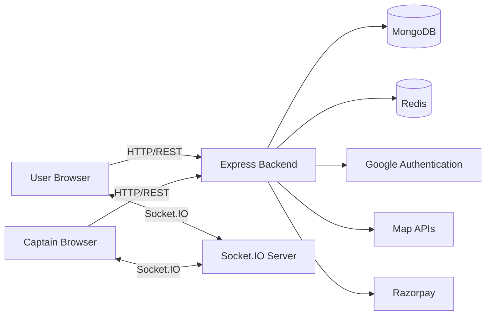

- **Frontend:** React route flows for authentication, booking, ride tracking, captain operations, maps, and payment.
- **Express backend:** Routes requests through validators, authentication middleware, controllers, and services.
- **MongoDB:** Stores users, captains, rides, payments, and blacklisted tokens.
- **Redis:** Provides the captain live-location GEO index and short-lived profile caches.
- **Socket.IO:** Delivers ride requests and ride/location state changes in realtime.
- **External services:** Google verifies identity tokens; Pelias/OpenRouteService supplies map data; Razorpay handles checkout and payment details.

The backend is started by `backend/server.js`, which connects to MongoDB, attempts Redis connection, creates an HTTP server from the Express app, initializes Socket.IO, and listens on `PORT`.

## Ride Data Flow

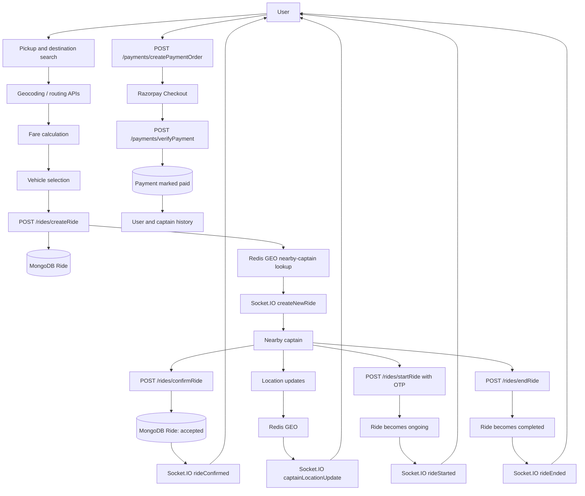

## User Ride Sequence

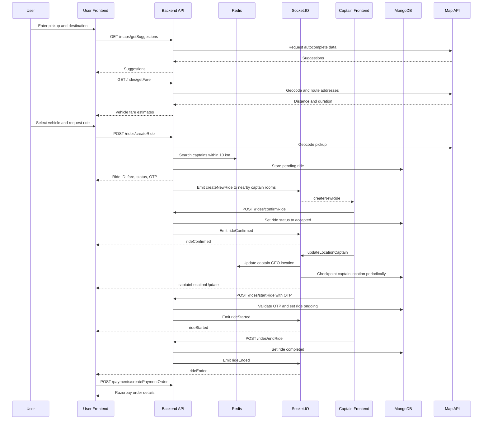

## Captain Ride Sequence

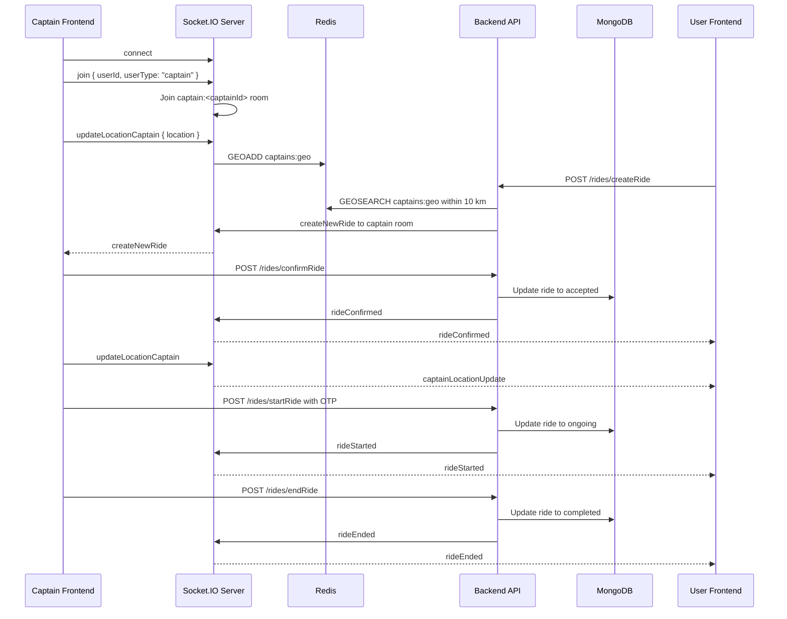

## Realtime Communication with Socket.IO

Socket.IO is used for events that should reach the other participant without polling. HTTP remains responsible for authenticated ride mutations; the server emits the resulting ride state to the relevant socket.

| Event | Direction | Purpose |
|---|---|---|
| `join` | Client -> server | Associates a socket with a user or captain; captains join `captain:<id>` |
| `updateLocationCaptain` | Captain -> server | Sends validated captain latitude and longitude |
| `createNewRide` | Server -> captain | Sends a new ride request to nearby captain rooms |
| `rideConfirmed` | Server -> user | Reports that a captain accepted the ride |
| `rideStarted` | Server -> user | Reports that OTP validation started the ride |
| `rideEnded` | Server -> user | Reports that the ride was completed |
| `captainLocationUpdate` | Server -> user | Sends active-ride captain location with `rideId` |
| `error` | Server -> socket | Reports invalid join or location data and socket failures |
| `disconnect` | Socket -> server | Removes a disconnected captain from the Redis GEO index |

The server stores user and captain socket IDs in MongoDB. Captain sockets are also tracked in memory and joined to captain-specific rooms. A captain location update is written to Redis immediately, forwarded to the active user when the captain has an accepted or ongoing ride, and checkpointed to MongoDB at most every 30 seconds.

### Socket Information Flow

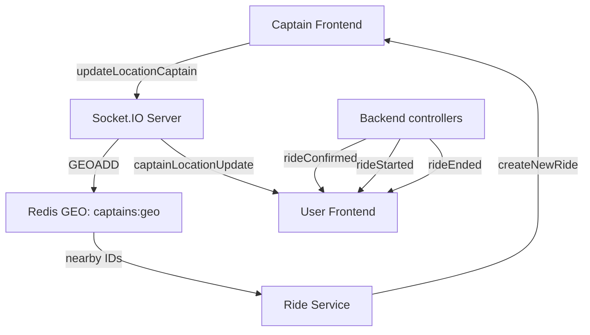

## Redis Architecture

Redis has two application responsibilities. It does not store ride state.

### Captain GEO Index

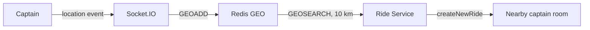

The GEO key is `captains:geo`. Coordinates are validated before storage. Nearby results are ordered nearest first. When Redis is unavailable, the ride service loads captains with MongoDB coordinates and applies a Haversine-distance filter. GEO entries are removed on captain socket disconnect.

### Profile Cache

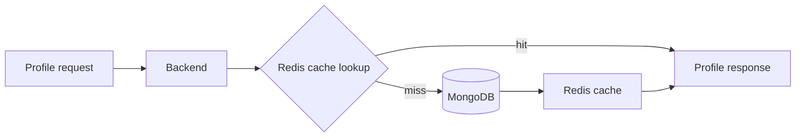

User profiles use `user:profile:<id>` and captain profiles use `captain:profile:<id>`. The cache TTL is 300 seconds. Cache failures and malformed entries fall back to MongoDB behavior.

## Google Authentication

The frontend obtains a Google ID token through Google Identity Services and sends it to the backend as `idToken`. `googleAuth.service.js` verifies the token with `google-auth-library`, the configured client ID, the Google account ID, the email, and `email_verified`.

### User Google Sign-In

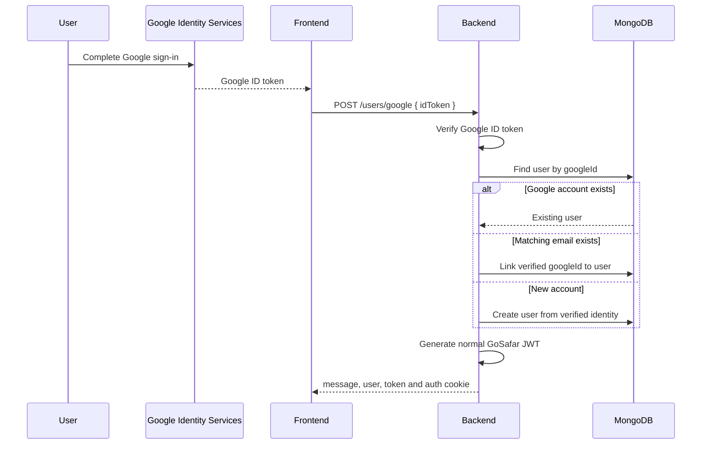

`POST /users/google` is public and accepts only `idToken`. Its successful response contains `message: "User signed in successfully"`, the `user` object, and a normal JWT `token`. Google-created users may not have a password.

### Captain Google Sign-In and Registration

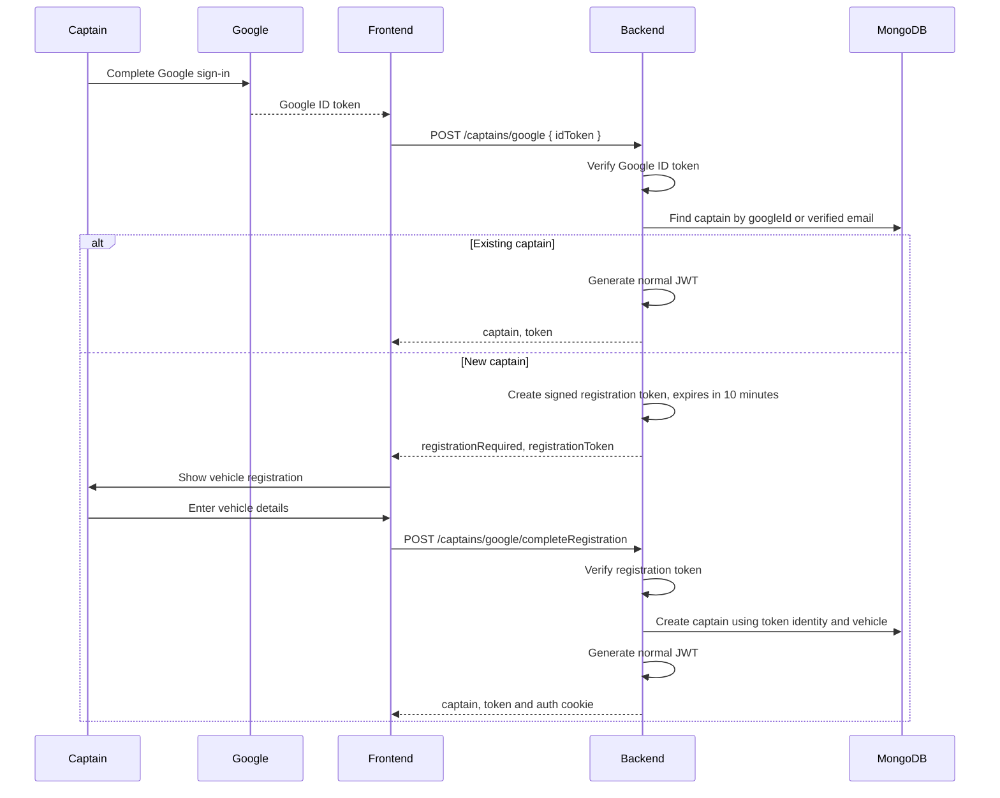

`POST /captains/google` is public. Existing captains receive `message`, `captain`, and `token`; new captains receive `message: "Complete captain registration"`, `registrationRequired: true`, and a short-lived `registrationToken` instead of an authenticated JWT.

`POST /captains/google/completeRegistration` is also public because the normal captain JWT does not exist yet. Its body contains `registrationToken` and `vehicle` with `color`, `plate`, `capacity`, and `vehicleType`. The supported vehicle values are `car`, `moto`, and `auto`. Email, Google ID, and name are taken from the signed token, not trusted from the request body.

## Payment Architecture

Payment state is isolated in a separate `Payment` document related to a ride. The `Ride` document stores ride state and fare; it does not store payment status, Razorpay IDs, or a payment signature. Ride history can populate the ride's virtual `payment` relationship.

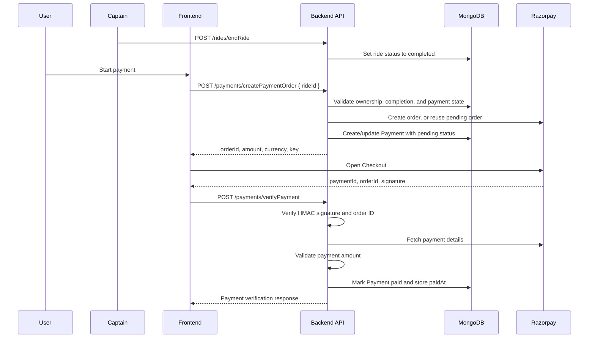

### Payment Security Flow

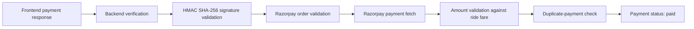

The current payment endpoints are `POST /payments/createPaymentOrder` and `POST /payments/verifyPayment`. Payment order creation requires an owned completed ride and returns the amount in paise. Verification requires `rideId`, `orderId`, `paymentId`, and `signature`; it verifies the payment record, order ID, signature, fetched Razorpay order, and amount before persisting `paid`, `razorpayPaymentId`, and `paidAt`.

## Ride State Machine

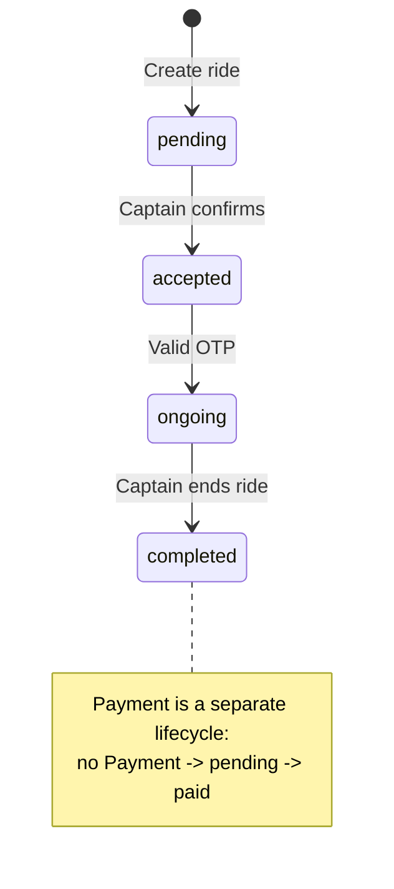

The schema also permits `cancelled`, but the current backend exposes no cancellation endpoint or implemented transition to it. Creating a payment order does not change the ride status.

## Database Architecture

### Major Models

- **User:** `fullname`, unique `email`, optional `googleId`, optional hidden `password`, and `socketId`.
- **Captain:** `fullname`, unique lowercase `email`, optional `googleId`, optional hidden `password`, `status`, `vehicle`, `location`, `locationUpdatedAt`, and `socketId`.
- **Ride:** `user`, optional `captain`, `pickup`, `destination`, `fare`, `status`, `duration`, `distance`, hidden `otp`, and timestamps. It exposes a virtual one-to-one `payment` relationship.
- **Payment:** unique `ride`, `user`, `amount`, `status`, `razorpayOrderId`, optional `razorpayPaymentId`, optional `paidAt`, and timestamps.
- **TokenBlacklist:** unique required `token` and timestamps; records expire through a three-day MongoDB TTL index.

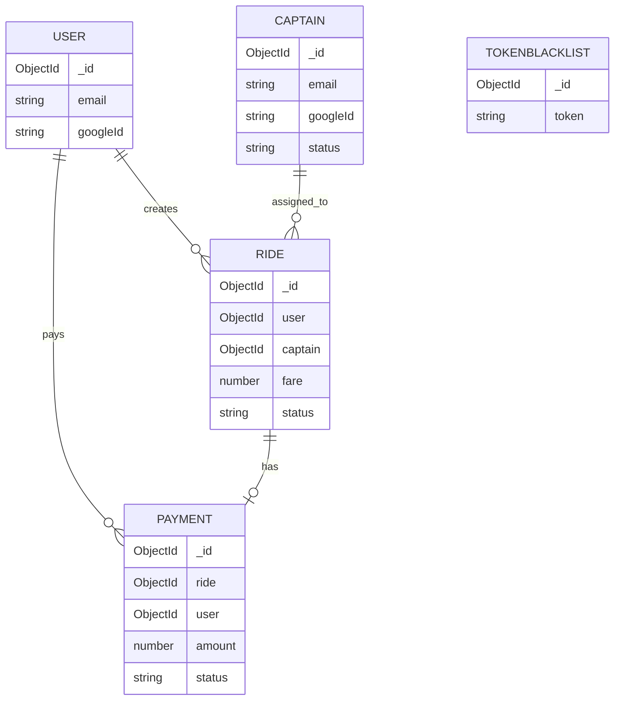

`TokenBlacklist` has no application-level reference to a user or captain; it stores revoked token strings used by both authentication middleware paths.

## Authentication Architecture

```mermaid
flowchart LR
    AUTH[Manual login or Google authentication] --> JWT[Generate GoSafar JWT]
    JWT --> STORE[Cookie and/or client token]
    STORE --> REQUEST[Protected request]
    REQUEST --> MW[authUser or authCaptain]
    MW --> BLACKLIST[Blacklist lookup]
    BLACKLIST --> VERIFY[JWT verification]
    VERIFY --> PROFILE[Load user/captain profile]
    PROFILE --> CONTROLLER[Set req.user or req.captain]
    CONTROLLER --> SERVICE[Controller/service operation]
```

Manual registration/login hashes and compares passwords with bcrypt. Google authentication verifies the Google ID token, then produces the same normal GoSafar JWT used by protected routes. Authentication middleware accepts the cookie token or a Bearer token, rejects blacklisted/invalid tokens, and loads the profile before dispatching to the controller.

## Map Data Flow

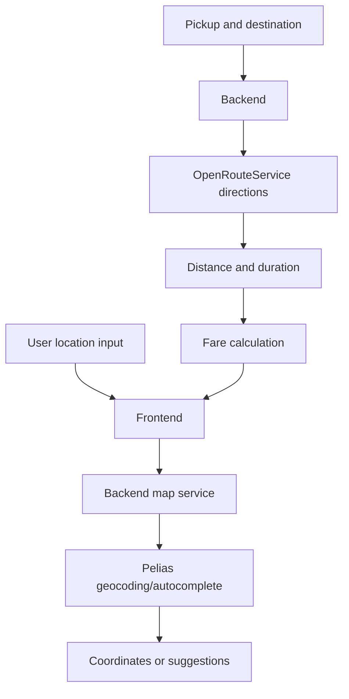

The backend uses Heigit Pelias search for coordinates and autocomplete, and OpenRouteService driving directions for distance and duration. Fare calculation uses the returned distance and duration with vehicle-specific rates.

## API Overview

Detailed endpoint documentation is maintained separately in [backend/README.md](backend/README.md).

- **Authentication:** User, captain, Google, and logout endpoints
- **Maps:** Coordinates, autocomplete, distance, and duration
- **Rides:** Fare, creation, confirmation, OTP start, and completion
- **Payments:** Razorpay order creation and verification
- **History:** User and completed captain ride history

## Project Structure

```text
GoSafar/
├── backend/
│   ├── src/
│   │   ├── config/
│   │   ├── controllers/
│   │   ├── middlewares/
│   │   ├── models/
│   │   ├── routes/
│   │   ├── services/
│   │   ├── validators/
│   │   └── socket.js
│   └── server.js
├── frontend/
│   └── src/
│       ├── features/
│       ├── contexts/
│       ├── config/
│       └── App.jsx
└── README.md
```

- **Backend routes/controllers:** HTTP composition and response handling.
- **Backend services:** Authentication, ride, map, payment, Razorpay, and Redis business logic.
- **Backend models:** Mongoose schemas and relationships.
- **Backend middleware/validators:** JWT authorization and request validation.
- **Socket layer:** Captain registration, location processing, room messaging, and ride event delivery.
- **Frontend features/contexts:** Role-specific screens, auth state, API clients, payment UI, maps, and socket connection.

## Security

- JWT authentication through cookies or Authorization headers
- Blacklist checks for revoked tokens
- bcrypt password hashing and comparison
- `express-validator` request validation
- Google ID-token verification with configured client ID
- Razorpay HMAC signature, order, and amount validation
- CORS restricted to `FRONTEND_URL` with credentials enabled
- Secrets and external-service configuration loaded from environment variables

## Key Engineering Decisions

| Decision | Reason |
|---|---|
| MongoDB/Mongoose | Persistent document data with explicit application schemas and references |
| Redis GEO | Fast nearest-captain lookup for ride dispatch |
| Redis profile cache | Reduce repeated profile reads while retaining MongoDB as source of truth |
| Socket.IO | Low-latency ride notifications and captain tracking without polling |
| Separate Payment model | Isolate payment lifecycle and provider metadata from ride state |
| Backend Google token verification | Keep identity and account-linking decisions server-trusted |
| Controller/service separation | Keep HTTP concerns separate from business operations |

## Running Locally

### Prerequisites

- Node.js
- MongoDB or MongoDB Atlas
- Redis
- Google OAuth client credentials
- ORS/Heigit API key
- Razorpay test credentials

### Environment Variables

Backend variables from `backend/src/config/env.js`:

```env
PORT
FRONTEND_URL
JWT_SECRET
MONGO_URI
ORS_API_KEY
REDIS_URL
RAZORPAY_KEY_ID
RAZORPAY_KEY_SECRET
GOOGLE_CLIENT_ID
```

Frontend variables used by the application:

```env
VITE_BACKEND_URL
VITE_GOOGLE_CLIENT_ID
```

### Backend

```bash
cd backend
npm install
npm run dev
```

Production start:

```bash
npm start
```

### Frontend

```bash
cd frontend
npm install
npm run dev
```

Build, lint, and preview commands:

```bash
npm run build
npm run lint
npm run preview
```

Kafka is not implemented. Realtime behavior is provided by Socket.IO, with Redis used for captain GEO indexing and profile caching.